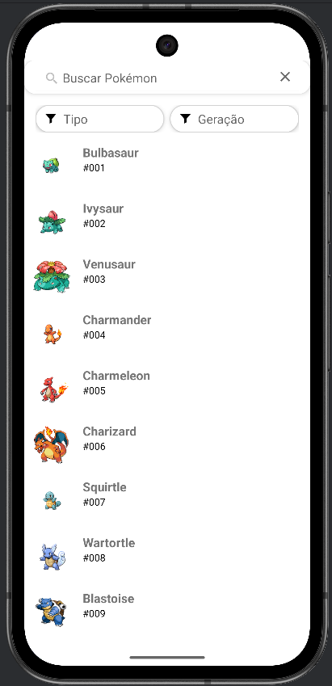
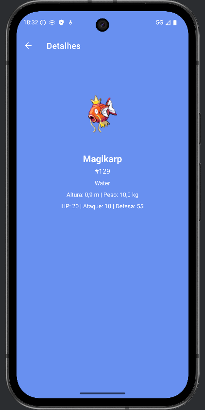
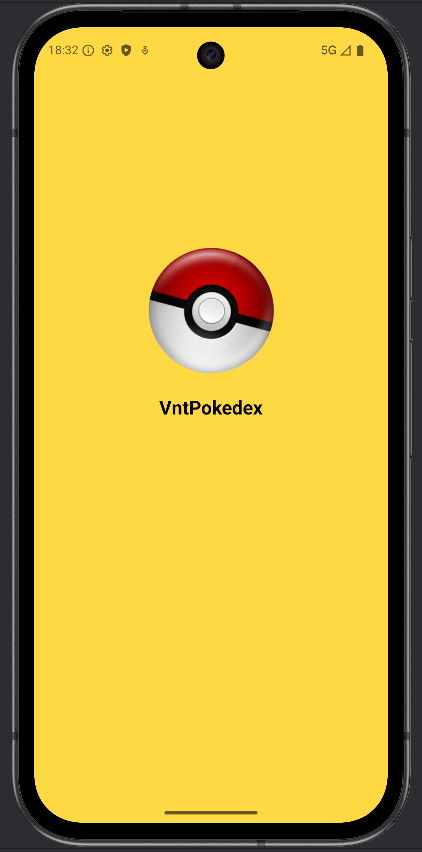

# VntPokedex

Uma Pokédex completa para Android desenvolvida em **Kotlin**, seguindo arquitetura **MVVM**, utilizando **Retrofit**, **Coroutines**, **Coil** e **DataStore** para persistência local.

O app permite:

- Listar Pokémon com imagens e ID
- Filtrar por **tipo** e **geração**
- Buscar Pokémon pelo nome
- Ver **detalhes completos** (tipos, medidas e status)
- Retém filtros ao navegar para detalhes e voltar
- Carregamento otimizado com **cache de tipos usando DataStore**

---

## 📱 Demonstração

| Lista filtrada                                 | Tela de detalhes                                 | Splash |
|------------------------------------------------|--------------------------------------------------|--------|
|  |  |  |

---

## 🧱 Arquitetura & Tecnologias

| Camada | Tecnologias |
|-------|-------------|
| UI | Fragments, RecyclerView, Material Components |
| Lógica | **ViewModel + LiveData + Coroutines** |
| Rede | **Retrofit + Gson** |
| Imagens | **Coil (com suporte a GIFs)** |
| Persistência de filtros & tipos | **DataStore Preferences** |
| Loading de detalhes | GIF animado com Coil |

### Estrutura do Projeto
```
data/
 ├─ local/TypeCacheDataStore.kt
 ├─ model/
 ├─ network/
 └─ repository/PokemonRepository.kt
ui/
 ├─ main/PokemonListFragment.kt
 ├─ detail/DetailFragment.kt
 └─ splash/SplashActivity.kt
viewmodel/
 ├─ PokemonViewModel.kt
 └─ PokemonDetailViewModel.kt
```

---

## 🚀 Como executar

1. Clone o repositório:
```bash
git clone git@github.com:EraldoCunha/vnt-pokedex.git
cd VntPokedex
```

2. Abra no **Android Studio**
3. Execute em um emulador ou dispositivo real

> 📌 **Requisitos mínimos:** Android 8+ (API 26+)

---

## 🧠 Destaques Técnicos

- Evita requisições desnecessárias ao API utilizando **cache persistente de tipos**
- Filtros são mantidos **mesmo ao navegar entre telas**
- Uso correto do ciclo de vida com **ViewModel**
- UI responsiva e acessível (descrições adicionadas para TalkBack)

---

## 🐱 Autor

**Eraldo Cunha**  

[](https://www.linkedin.com/in/eraldojacunha/)

[](mailto:eraldo_cunha@hotmail.com)

💼 Buscando oportunidades como Desenvolvedor Android / Backend

---

## ⭐ Contribuição

Se gostou do projeto, deixe uma ⭐ no repositório — isso ajuda muito 😊
